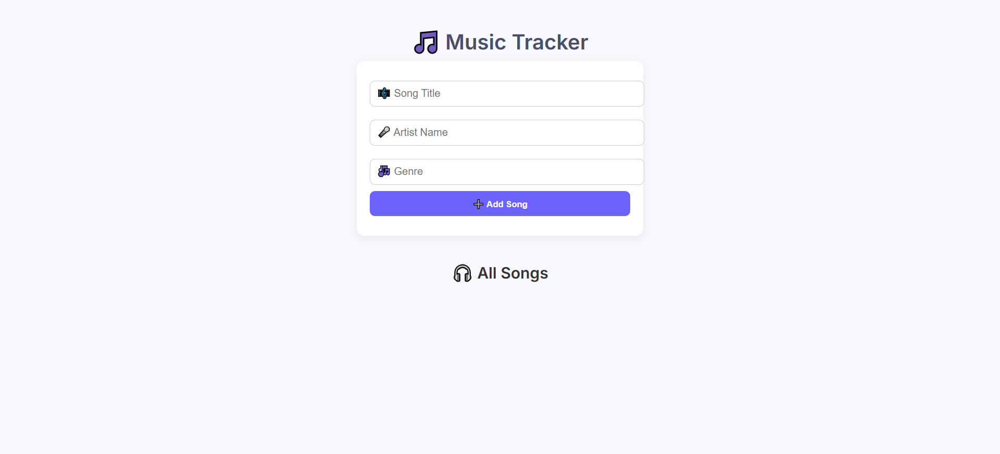

# 🎵 Music Tracker API

A simple and fully local **Node.js + SQLite3** project to manage a list of songs using RESTful APIs. Includes an optional HTML frontend for basic browser-based interaction.

> 🔒 Fully offline — no external APIs required.

---

## 📁 Project Structure

```bash
📦 Music Tracker API
├── controllers/
│ └── songController.js # Logic for API actions
├── routes/
│ └── songRoutes.js # API route definitions
├── db.js # Database connection and table creation
├── music.db # SQLite3 database file
├── server.js # Express server setup
├── MusicAPI.html # Optional frontend
└── README.md # Documentation
```

---

## ✨ Features

- 🎵 Add and view songs with RESTful API endpoints  
- 🗃️ Uses a local SQLite3 database  
- 🧠 Auto-creates DB schema on server start  
- 📊 View/edit DB using DB Browser for SQLite  
- 🌐 Includes simple HTML frontend (optional)  
- 📁 Clean project structure for scalability  

---

## Screenshot



---

## 🚀 Installation

### 1. Clone the Repository

```bash
git clone https://github.com/your-username/music-tracker-api.git
cd music-tracker-api
```

### 2. Install Dependencies

```bash
npm install
```

### 3. Start the Server

```bash
node server.js
```
The server will run at: http://localhost:5000

---

## 📡 API Endpoints

### GET /api/songs

Fetches all songs from the database.
Response Example:

```bash
[
  {
    "id": 1,
    "title": "Test Song",
    "artist": "Tester",
    "genre": "Rock"
  }
]
```

### POST /api/songs

Adds a new song to the database.
Request Body:

```bash
{
  "title": "Shape of You",
  "artist": "Ed Sheeran",
  "genre": "Pop"
}
```

Response:
```bash
{
  "id": 2,
  "title": "Shape of You",
  "artist": "Ed Sheeran",
  "genre": "Pop"
}
```

---

## 📬 Sample cURL Commands

### Add a Song:

```bash
curl -X POST http://localhost:5000/api/songs \
  -H "Content-Type: application/json" \
  -d "{\"title\":\"Test Song\", \"artist\":\"Tester\", \"genre\":\"Rock\"}"
```

### Get All Songs:

```bash
curl http://localhost:5000/api/songs
```

---

## 🌐 Optional Frontend

Open the `MusicAPI.html` file in your browser for a simple UI to interact with the API.

### Features:

1. ➕ Add a new song using a form
2. 📄 View all songs in a list

### How to Use:

1. Ensure the server is running
2. Open MusicAPI.html in your browser
3. Fill out the form and click "Add Song"

> 💡 You can enhance the frontend with form validation, custom styling, or search filters.

---

## 🧠 Database Details

1. 📁 Database File: `music.db`
2. 🛠️ Managed using: DB Browser for SQLite
3. 🔄 Tables are automatically created on server startup via `db.js`


## Table Schema

```bash
CREATE TABLE IF NOT EXISTS songs (
  id INTEGER PRIMARY KEY AUTOINCREMENT,
  title TEXT,
  artist TEXT,
  genre TEXT
);
```

---

## 🧰 Tech Stack

1. Backend: Node.js, Express.js
2. Frontend: HTML,CSS,JS
3. Database: SQLite3
4. Tools: DB Browser, cURL

---

## 🤝 Contributing

Contributions are welcome!

1. Fork this repository
2. Create a new branch: git checkout -b feature-name
3. Make your changes and commit them
4. Push to your fork: git push origin feature-name
5. Submit a pull request 🚀

Please ensure your code is clean and includes helpful comments where appropriate.

---

## 📄 License

This project is open-source and free to use. Feel free to fork and modify for learning or improvement!
